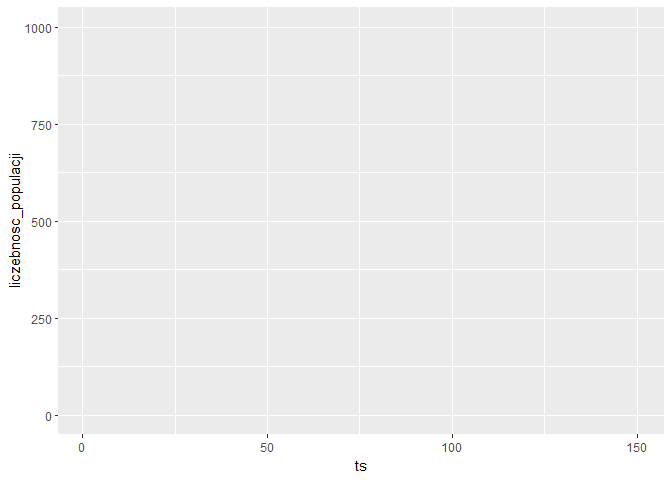

  Projekt ma na celu stworzenie uproszczonej symulacji rozprzestrzeniania sie chorob zakaznych. Uproszczenia te polegaja na przyjeciu jedynie kilku, z wielu cech które wplywac moga na rozwoj sytuacji.  

Pierwszym etapem jest stworzenie przestrzeni i umieszczenie na niej pewnej populacji (pola niebieskie na macierzy to przestrzen zajeta przez ludzi, pola biale to pusta przestrzen).  <br/>

```{r cars, include=FALSE}
library(plot.matrix)
library(ggplot2)
library(gganimate)
High = 100
Width = 100
Population = 1000 
first_vacc = 50
dose = 4
doseSD = 2
baseDrate = 0.0075
baseDrateSD = 0.0025
baseINFrate = 0.3
baseINFrateSD = 0.01
totalts = 100
nameoutput = 'simulation4'
```
```{r s area plot,fig.height = 9, fig.width = 9, fig.align = "center"}
total = c(c(rep(1,Population)),                             # 0 - pusta przestrzeń
            c(rep(0,High * Width - Population)))            # 1 - zajęta przestrzeń przez człowieka
  
  Total = sample(x = total,                                 # Losowo wyznaczone miejsca puste i zajęte                       
                 size = length(total),
                 replace = F)
  Matrix = matrix(data = Total,                             # Stworzenie przestrzeni 2 wymiarowej
                  nrow = High,
                  ncol = Width)
  plot(Matrix,                                              # Wykres rozmieszczenia
       col = c('white','blue'),
       xlab = 'Geom Width',
       ylab = 'Geom_High')
```
<br/> Nastepnie do wygenerowanej przestrzeni w wolne miejsce dodana zostaje jedna jednostka chora (pole czerwone).  
```{r area plot,fig.height = 10, fig.width = 10, fig.align = "center"}

  Vectorized_Matrix = as.vector(Matrix)
  Randomspot_vectorized = sample(x = c(High*Width),
                                 size = 1)
  while (Vectorized_Matrix[Randomspot_vectorized] == 1){
    Randomspot_vectorized = sample(x = c(High*Width),
                                   size = 1)}
  Vectorized_Matrix[Randomspot_vectorized] = 2
  Matrix <<- matrix(data = Vectorized_Matrix,                 # Aktualizacja przestrzeni o osobe chora               
                  nrow = High,
                  ncol = Width)
  plot(Matrix,                                              # Wykres rozmieszczenia
       col = c('white','blue','red'),
       xlab = 'Geom Width',
       ylab = 'Geom_High')
```
<br/> Kolejnym krokiem zaprojektowanie procesu z ktorego skladac bedzie sie symulacja, zostala ona podzielona na cztery etapy: <br/>

1. Testowanie infekcji - etap infekcji, sprawdzenie czy jednostek ktore znajduja sie w obszarze obok osob chorych pod katem zakazenia. Mozliwosc zakazenia sie okreslona jest pewnym prawdopodobienstwem.<br/>
2. Testowanie smiertelnosci - etap w ktorym jednostki chore poddawane sa testowi w ktorym z pewnym prawdopodobienstwem usuniete zostana one calkowicie z populacji(smierc).<br/>
3. Testowanie wyzdrowień - etap w ktorym czesc jednostek z okresu sprzed 14 dni zdrowieje.<br/>
4. Wakcynacja - etap w ktorym jednostki zdrowe sa poddawane szczepieniu ktore uodparnia je od mozliwosci zachorowania.<br/>
<br/> Szczególowo etapy te zostaly okreslone ponizej: <br/>
1. Testowanie infekcji. <br/>
```{r Inf_test - invisibe, include=FALSE}
    inf_rate = 0.3
    #Wyznaczenie Przestrzeni rozprzestrzeniania sie, podstawa , coordynat zarazonego daje obszar mozliwosci zakazenia 5x5
    coords  = which(Matrix == 2, arr.ind=TRUE)
    #Ustanowienie obszaru zarażonych, z wyjątkami dla ścian bocznych
    sickrows = data.frame()
    sickcols = data.frame()
    for (i in coords[,1]){
      if (i %in% c(3:(High-2))){ sickrows = rbind(sickrows,c(i-2,i+2)) }
      if (i == 1){ sickrows = rbind(sickrows,c(i,i+2)) }
      if (i == 2){ sickrows = rbind(sickrows,c(i-1,i+2)) }
      if (i == (High-1)){ sickrows = rbind(sickrows,c(i-2,i+1)) }
      if (i == High){ sickrows = rbind(sickrows,c(i-2,i)) }
    }
    for (i in coords[,2]){
      if (i %in% c(3:(Width-2))){ sickcols = rbind(sickcols,c(i-2,i+2)) }
      if (i == 1){ sickcols = rbind(sickcols,c(i,i+2)) }
      if (i == 2){ sickcols = rbind(sickcols,c(i-1,i+2)) }
      if (i == (Width-1)){ sickcols = rbind(sickcols,c(i-2,i+1)) }
      if (i == Width){ sickcols = rbind(sickcols,c(i-2,i)) }
    }
    sickcoords = cbind(sickrows,sickcols)
    colnames(sickcoords)= c('left','right','upper','bottom')
    sickarea = data.frame(matrix(0,High,Width))
    for (i in 1:nrow(sickcoords)){
      sickarea[sickcoords$left[i]:sickcoords$right[i],sickcoords$upper[i]:sickcoords$bottom[i]] = 1
    }
    #wygenerowanie obszaru na ktorym znajduja sie ludzie ktorych trzeba poddac testowi na zarazenie
    sickarea[sickarea == T] = 1 # seting area of sick ppl influence to 1 to check with relations of other dataframe
    sickarea[sickarea == F] = 9 # number producing false
    df3 = Matrix[] == sickarea[]
    coords2  = which(df3 == 1, arr.ind=TRUE)
    coords2 = cbind(coords2,sample(c(T,F),nrow(coords2),replace = T,prob = c(inf_rate,(1-inf_rate))))
    coords2 = as.data.frame(coords2)
    ppl_in_risk_area = nrow(coords2)
    ppl_in_risk_area 
    coords2 # coordynaty jednostek poddanych testowi i ich wynik 
    #if (ppl_in_risk_area > 0){                                       # czesc funkcyjna - wykorzystana pozniej , zmienia wartosc w glownej macierzy osob nowo zainfekowanych
    #  for (i in 1:nrow(coords2)){
    #    if (nrow(coords2)>0){
    #      if (coords2$V3[i] == 1){  
    #        Matrix[coords2$row[i],coords2$col[i]] <<- c(2)
    #      }
    #      else {
    #        Matrix[coords2$row[i],coords2$col[i]] <<- c(1)
    #        
    #      }
    #    }
    #  }
    #}

```
```{r Inf_test - function, message=FALSE, warning=FALSE}
 infectiontest = function(inf_rate){
    #Wyznaczenie Przestrzeni rozprzestrzeniania sie, podstawa , coordynat zarazonego daje obszar mozliwosci zakazenia 5x5
    coords  = which(Matrix == 2, arr.ind=TRUE)
    #Ustanowienie obszaru zarażonych, z wyjątkami dla ścian bocznych
    sickrows = data.frame()
    sickcols = data.frame()
    for (i in coords[,1]){
      if (i %in% c(3:(High-2))){ sickrows = rbind(sickrows,c(i-2,i+2)) }
      if (i == 1){ sickrows = rbind(sickrows,c(i,i+2)) }
      if (i == 2){ sickrows = rbind(sickrows,c(i-1,i+2)) }
      if (i == (High-1)){ sickrows = rbind(sickrows,c(i-2,i+1)) }
      if (i == High){ sickrows = rbind(sickrows,c(i-2,i)) }
    }
    for (i in coords[,2]){
      if (i %in% c(3:(Width-2))){ sickcols = rbind(sickcols,c(i-2,i+2)) }
      if (i == 1){ sickcols = rbind(sickcols,c(i,i+2)) }
      if (i == 2){ sickcols = rbind(sickcols,c(i-1,i+2)) }
      if (i == (Width-1)){ sickcols = rbind(sickcols,c(i-2,i+1)) }
      if (i == Width){ sickcols = rbind(sickcols,c(i-2,i)) }
    }
    sickcoords = cbind(sickrows,sickcols)
    colnames(sickcoords)= c('left','right','upper','bottom')
    sickarea = data.frame(matrix(0,High,Width))
    for (i in 1:nrow(sickcoords)){
      sickarea[sickcoords$left[i]:sickcoords$right[i],sickcoords$upper[i]:sickcoords$bottom[i]] = 1
    }
    #wygenerowanie obszaru na ktorym znajduja sie ludzie ktorych trzeba poddac testowi na zarazenie
    sickarea[sickarea == T] = 1 # seting area of sick ppl influence to 1 to check with relations of other dataframe
    sickarea[sickarea == F] = 9 # number producing false
    df3 = Matrix[] == sickarea[]
    coords2  = which(df3 == 1, arr.ind=TRUE)
    coords2
    coords2 = cbind(coords2,sample(c(T,F),nrow(coords2),replace = T,prob = c(inf_rate,(1-inf_rate))))
    coords2 = as.data.frame(coords2)
    ppl_in_risk_area = nrow(coords2)
    if (ppl_in_risk_area > 0){
      for (i in 1:nrow(coords2)){
        if (nrow(coords2)>0){
          if (coords2$V3[i] == 1){  
            Matrix[coords2$row[i],coords2$col[i]] <<- c(2)
          }
          else {
            Matrix[coords2$row[i],coords2$col[i]] <<- c(1)
            
          }
        }
      }
    }
  } # test infekcji nowych jednostek ktore nie sa zakazone i nie
```
Dla kazdej jednostki chorej wyznaczany jest obszar 5x5 gdzie jej punkt jest srodkokiem tego kwadratu(wyjatkami sa jednostki zajmujace miejsce przy bokach macierzy. wtedy ten obszar zostaje skrocony do boków) Nastepnie w tym obszarze zostaja wyznaczony jednostki które beda testowane zgodnie z wyznaczonym prawdopodobienstwem infekcji. Jezeli losowanie powiedzie sie. Jednostka zostaje oznaczona na macierzy jako chora. Ponizej zaprezentowano obszar oddzialywania pierwszej chorej jednostki. Na kolejnym osoby ktore znajduja sie w tym obszarze. <br/>
```{r Inf_test area plot,fig.height = 10, fig.width = 10, fig.align = "center"}
plot(as.matrix(sickarea),                                              # Wykres Obszaru oddzialywania
       col = c('red','white'),
       xlab = 'Geom Width',
       ylab = 'Geom_High')
plot(as.matrix(df3),                                              # Wykres rozmieszczenia ludzi w obszarze oddzialywania
       col = c('white','orange'),
       xlab = 'Geom Width',
       ylab = 'Geom_High')
```
<br/> Jezeli jednostka zdrowa przejdzie wynik testu pozytywnie jej wartosc na macierzy zmieniona zostaje z 1 na 2 gdzie 1 oznacza jednostki zdrowe, 2 jednostki chore. <br/>
2. Testowanie smiertelnosci <br/>
Populacja osob chorych poddawana jest próbie smiertelnosci. Przezycie wszystkich jednostek chorych sprawdzane jest okreslonym prawdopodobienstwem. Jezeli wynik tej proby dla danej jednostki bedzie pozytywny. Jej wartosc na glownej macierzy zmieniana jest z 2 na 0 co oznacza smierc i usuniecie z przestrzeni.<br/>
```{r deathtest function}
 deathtest = function(deathrate){
    vec = as.vector(Matrix)
    coords_ppl  = which(vec == 2, arr.ind=TRUE)
    for (i in coords_ppl){
      testvalue = sample(x = c(1,0),size = 1,prob = c(deathrate,(1-deathrate)))  
      if (testvalue == 1){
        vec[i] = 0
        Matrix <<- matrix(vec,
                          nrow = High,
                          ncol = Width)# 0 poniewaz umiera i zostawia pustą przestrzeń
      }
    }
  }
```
3. Testowanie wyzdrowień <br/>
Jednostki chore nastepnie poddawane sa testowi na wyzdrowienie. Ilosc osob wyzdrowien jest zdeterminowana przez : **rozstep(t-15,t-14)/ obecnie zainfekowani**. Tak zdeterminowany wspolczynnik zastosowany zostal do prawdopodobienstwa wyzdrowienia i przetestowany na kazdej jednostce chorej. Jednostki z pozytywnym wynikiem wracaja do zdrowia i zostaja oznaczone cyfra 1 na macierzy. Jednostki te moga ponownie zachorowac.<br/> 
```{r}
healtest = function(heal_chance){
    vec = as.vector(Matrix)
    coords_ppl  = which(vec == 2, arr.ind=TRUE)
    for (i in coords_ppl){
      healtestvalue = sample(x = c(1,0),size = 1,prob = c(heal_chance,(1-heal_chance)))   #1 -  wyzdrowial
      if (healtestvalue == 1){
        vec[i] = 1
        Matrix <<- matrix(vec,
                          nrow = High,
                          ncol = Width) # 1 - poniewaz wraca do bycia zdrowym
      }
    }
  }
  
```
4. Wakcynacja <br/>
Po okreslonym z gory okresie(liczbie iteracji) oraz liczbie szczepionek ktora jest dostepna kazdego dnia. Losowe zdrowe jednostki z populacji zostaja wybrane i oznaczone jako zaszczepione(cyfra 3). Te jednostki nie moga sie ponownie zakazic. <br/>
```{r}
vaccination = function(first_vacc, doses){
    if (t>first_vacc){
      vec = as.vector(Matrix)
      if(doses<length(Matrix[Matrix==1])){
        coords_vacc  = sample(which(vec == 1, arr.ind=TRUE),doses)
      } else{
        coords_vacc = sample(which(vec == 1, arr.ind=TRUE),length(Matrix[Matrix==1]))
      }
      for (i in coords_vacc){
        vec[i] = 3
      }
      Matrix <<- matrix(vec,
                        nrow = High,
                        ncol = Width)
    } else{
      print("No vaccination during this period")
    }
  }
```
Przy przeprowadzonej w taki sposob symulacji zebrane zostaja dane z kazdej iteracji. Symulacja w formie funkcji zostala dostarczona w osobnym pliku. Zmienne ktorymi mozna manipulowac przy niej to:<br/>
High - wysokosc macierzy (int)<br/>
Width - dlugosc macierzy (int)<br/>
Population - Populacja (sugerowana 1/10 przestrzeni) (int)<br/>
first_vacc - iteracja w ktorej rozpoczynaja sie szczepienia (int) <br/>
dose - losowana liczba dawek z rozkladu normalnego podanej sredniej (dose) i odchylenia standardowego doseSD()<br/>
doseSD - losowana liczba dawek z rozkladu normalnego podanej sredniej (dose) i odchylenia standardowego doseSD()<br/>
baseDrate - losowane prawdopodobienstwo zgonu z sredniej baseDrate i odchylenia baseDrateSD  <br/>
baseDrateSD - losowane prawdopodobienstwo zgonu z sredniej baseDrate i odchylenia baseDrateSD<br/>
baseINFrate - losowane prawdopodobienstwo z sredniej baseINFrate i odchylenia baseINFrateSD<br/>
baseINFrateSD - losowane prawdopodobienstwo z sredniej baseINFrate i odchylenia baseINFrateSD<br/>
totalts - liczba iteracji -1<br/>
name - nazwa pliku do zapisu animacji gif lub jego sciezka ( bez rozszczenienia '.gif')<br/>
<br/>
W pliku zawarte zostaly takze proponowane ilosci takie jak rozmiar macierzy. 100x100, populacja -1000, pierwsze szczepionki dostepne od 50 iteracji. srednia i rozklad normalny ilosci dawek dla losowania z rokladu normalnego takze dla prawdopodobienstwa zgonu, prawdopodobienstwa infekcji. Oraz liczba iteracji i nazwa pliku/sciezka wyjsciowego dla animacji .gif<br/>
```{r include=FALSE}
rm(list = ls())
```
```{r}
source('simulation as function.R')
```
Na wykresie zaprezentowano jak rozwijala sie sytuacja w symulacji. Widoczna jest sezonowosc zachorowan. I ograniczenie rozprowadzania sie choroby przy wykorzystaniu szczepien.
```{r message = FALSE, warning = FALSE, results = FALSE,}
library(ggplot2)
library(gganimate)
print(summarystats)
animate = ggplot(summarystats, aes(x=ts)) + 
  geom_line(aes(y = liczebnosc_populacji), color = "black") + 
  geom_line(aes(y = liczba_zarazonych), color="red") +
  geom_line(aes(y = liczba_zaszczepionych), color="green") + 
  transition_reveal(ts)
anim_save(paste0(nameoutput,".gif"),animate)
```
<center><center/><br/>
Nieruchomy wykres. Linia czarna - populacja, czerwona - liczba chorych, zielona, liczba zaszczepionych
```{r, fig.align= "center"}
ggplot(summarystats, aes(x=ts)) + 
  geom_line(aes(y = liczebnosc_populacji), color = "black") + 
  geom_line(aes(y = liczba_zarazonych), color="red") +
  geom_line(aes(y = liczba_zaszczepionych), color="green")
```